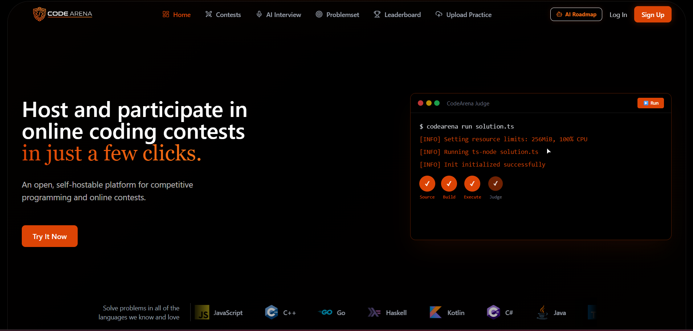
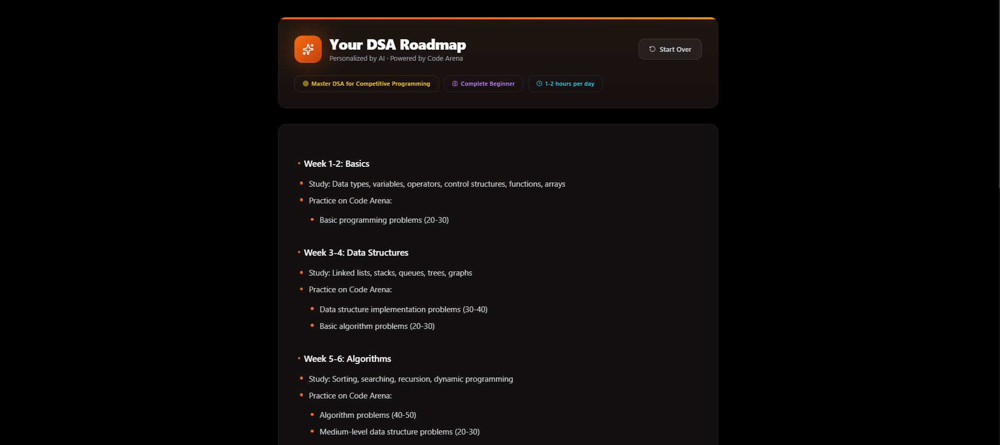
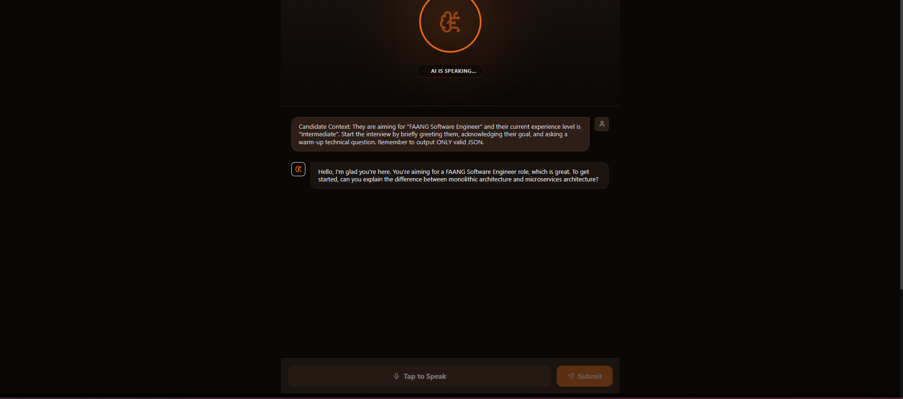
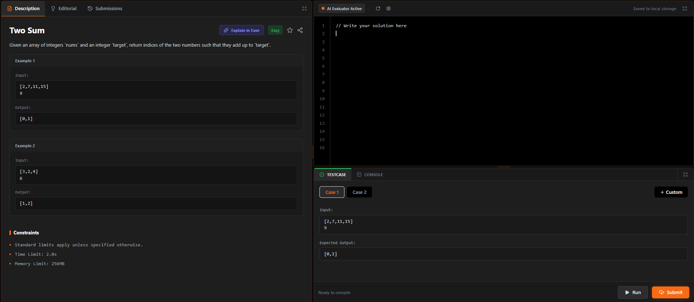
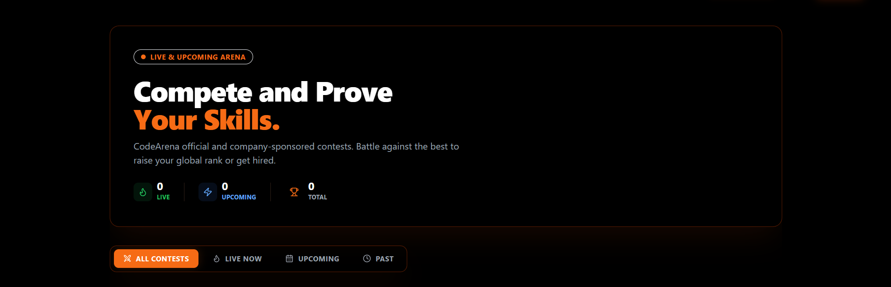
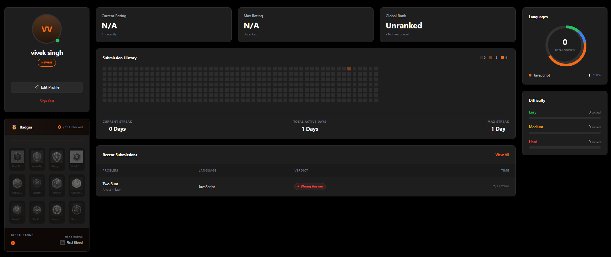
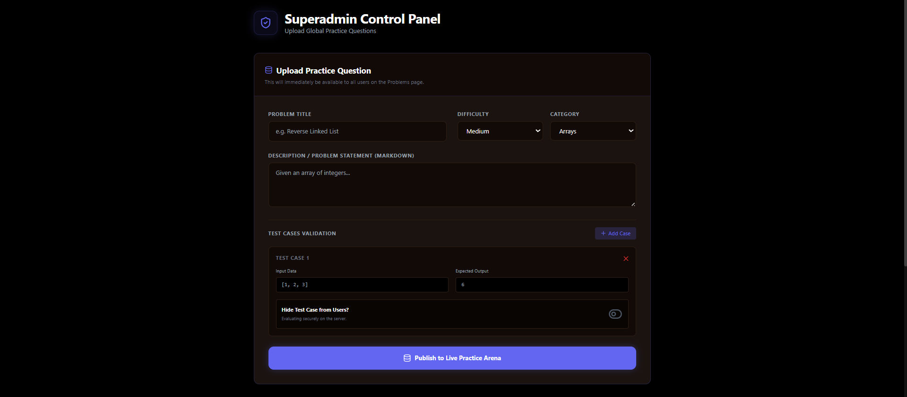
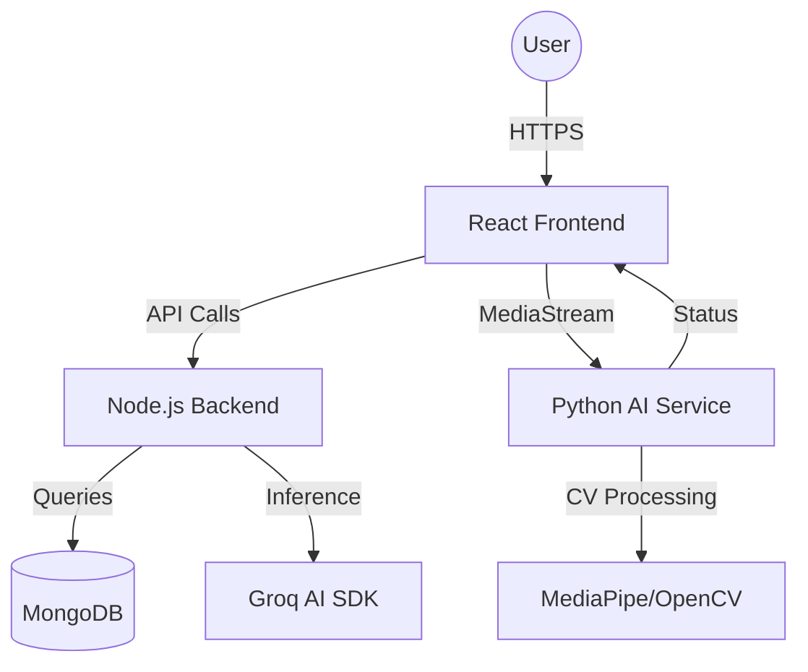

<div align="center">
  

  # 🏆 CodeArena
  ### *Elevating Competitive Programming with AI & Real-time Proctoring*

  [](https://reactjs.org/)
  [](https://nodejs.org/)
  [](https://www.mongodb.com/)
  [](https://www.python.org/)
  [](https://tailwindcss.com/)
  [](https://groq.com/)

  [**Overview**](#-overview) • [**Key Features**](#-key-features) • [**Tech Stack**](#-tech-stack) • [**Screenshots**](#-visual-showcase) • [**Getting Started**](#-getting-started) • [**Architecture**](#-architecture)

</div>

---

## 🌟 Overview

**CodeArena** is a comprehensive, state-of-the-art competitive programming and coding practice platform designed for the modern developer. It doesn't just stop at hosting problems; it leverages **AI-driven insights** to guide your learning journey and uses **Computer Vision** to ensure fair play during contests.

Whether you're a student preparing for interviews or a professional honing your skills, CodeArena provides a premium, interactive environment to excel.

---

## 🎨 Visual Showcase

<div align="center">
  
</div>

---

## 🚀 Key Features

### 🤖 AI-Powered Intelligence
- **AI Personalized Roadmap**: Get a custom-tailored DSA learning path (8-12 weeks) based on your target goal, current experience level, and daily time commitment. Powered by **llama-3.3-70b-versatile**, it identifies exactly what to study and which CodeArena problems to solve.
- **AI Mock Interview**: Experience a full technical interview conducted by an AI "Senior Software Engineer." It transitions seamlessly from behavioral/theoretical questions to a live coding round, providing a comprehensive final report with strengths, areas for improvement, and a performance score.
- **AI Hints & Explanations**: Struggling with a bug? Our Groq-powered AI provides context-aware hints and detailed code explanations to help you understand the *why* behind a solution.

### ⚔️ Competitive Excellence
- **Advanced Code Compiler**: A low-latency online judge that supports multiple programming languages. It features real-time test case execution, memory/time limit tracking, and instant feedback on code efficiency.
- **Competitive Arena**: Participate in high-stakes contests created by top tech companies. Features include live leaderboards, progress tracking (sequential unlock of problems), and integrated anti-cheat proctoring.
- **Real-time Leaderboards**: Keep track of global rankings, user ratings, and contest performance with instantaneous updates.

### 🛡️ AI Proctoring & Fairness
- **Real-time Face Tracking**: A dedicated Python-Flask service using **MediaPipe** and **OpenCV** to track head pose (tilt/yaw) and ensure the candidate is facing the screen.
- **Integrity Alerts**: Automatically detects multiple faces, camera obstruction, or suspicious movement, with the ability to disqualify participants in real-time.

### 🎮 Gamification & Streaks
- **Activity Heatmap**: A GitHub-style contribution graph that visualizes your daily coding consistency.
- **Streak System**: Earn and maintain daily streaks to stay motivated. Both current and maximum streaks are tracked to encourage long-term discipline.
- **Badges & Ratings**: Unlock unique badges for achieving milestones and climb the global rating ladder by solving complex problems and winning contests.

### 🛡️ Admin & Control Panel
- **Multi-Role Management**: Role-based access control for **Members**, **Admins**, and **Superadmins**.
- **Company Dashboard**: Dedicated interface for partner companies to create, manage, and moderate their own coding contests and problem sets.
- **Superadmin Control**: Full platform oversight, including user moderation, contest scheduling, and system-wide performance analytics.

---

## 🛠️ Tech Stack

### **Frontend**
- **React 19 & Vite**: High-performance rendering and modern development workflow.
- **Tailwind CSS**: For a sleek, responsive, and developer-friendly UI.
- **Framer Motion**: Smooth, premium micro-animations and transitions.
- **Lucide React**: Beautifully crafted icons.

### **Backend**
- **Node.js & Express**: Scalable API architecture.
- **MongoDB & Mongoose**: Flexible, schema-based data modeling.
- **JWT Authentication**: Secure, stateless user sessions.
- **Nodemailer**: For automated communication and notifications.

### **AI & ML Integration**
- **Groq SDK**: Blazing-fast inference for generating AI roadmaps, hints, and interviews.
- **Python-Flask Service**: Dedicated API for Computer Vision tasks.
- **MediaPipe & OpenCV**: Advanced face detection and head pose estimation.

---

## 📸 Feature-by-Feature Walkthrough

### 🚀 The CodeArena Dashboard
<div align="center">
  
</div>
Your central command center for competitive programming. Access real-time contest updates, trending problems, and your personalized AI mentor from a sleek, dark-themed interface built for focus and performance.

---

### 🗺️ AI Personalized Roadmaps
<div align="center">
  
</div>
Stop wondering what to learn next. This feature takes your career goals (e.g., "SDE at Google") and your current level to generate a week-by-week DSA roadmap. It doesn't just list topics; it links you directly to relevant problems on the platform to verify your progress.

---

### 🎙️ AI Mock Interviews
<div align="center">
  
</div>
Practice in a low-stakes environment that feels real. Our AI interviewer uses voice interactions and chat to grill you on data structures, algorithms, and system design. At the end, you get a full breakdown of your performance, including code quality and communication scores.

---

### 💻 Advanced Area Compiler
<div align="center">
  
</div>
A professional-grade code editor that supports multi-language compilation. It features integrated test cases, execution time tracking, and memory usage metrics. The compiler is deeply integrated with our AI to provide hints if you're stuck on a specific logic error.

---

### ⚔️ Competitive Arena
<div align="center">
  
</div>
Join live contests with thousands of participants. The arena includes a sequential problem-solving flow where challenges are unlocked as you progress. Real-time proctoring ensures that everyone plays by the rules through face-tracking and session integrity checks.

---

### 🎮 Gamification & Streaks
<div align="center">
  
</div>
Consistency is key to mastery. Track your daily progress with our GitHub-style activity heatmap and maintain your streak to climb the global leaderboard. Earn unique badges as you reach milestones like "100 Problems Solved" or "Contest Winner."

---

### 🛡️ Superadmin Control Panel
<div align="center">
  
</div>
A powerful administrative engine for managing the entire ecosystem. Admins can moderate users, schedule global contests, and analyze platform-wide growth metrics. Partner companies use a similar dashboard to manage their private recruitment contests.

---

## 🏗️ Architecture



---

## 🏁 Getting Started

### Prerequisites
- **Node.js** (v18+)
- **MongoDB** (Atlas or Local)
- **Python** (v3.10+)
- **Git**

### 📦 Installation & Setup

1. **Clone the Repository**
   ```bash
   git clone https://github.com/your-username/CodeArena.git
   cd CodeArena
   ```

2. **Setup Backend**
   ```bash
   cd Backend
   npm install
   # Create a .env file with your MONGO_URI, JWT_SECRET, GROQ_API_KEY, etc.
   npm run dev
   ```

3. **Setup Frontend**
   ```bash
   cd ../Frontend
   npm install
   npm run dev
   ```

4. **Setup AI Proctoring Service**
   ```bash
   cd ../face
   # Create a virtual environment
   python -m venv venv
   source venv/bin/activate  # Or venv\Scripts\activate on Windows
   pip install -r requirements.txt
   python app.py
   ```

---

## 🛡️ Proctoring Details
The face recognition service (`/face`) provides:
- **Head Tilt/Yaw Detection**: Alerts if the user looks away from the screen.
- **Multiple Face Detection**: Prevents unauthorized assistance.
- **Brightness Monitoring**: Ensures the environment is well-lit for scanning.

---

## 🤝 Contributing
Contributions are welcome! Please feel free to submit a Pull Request or open an Issue.

---

<div align="center">
  Built with ❤️ for the Coding Community
</div>
